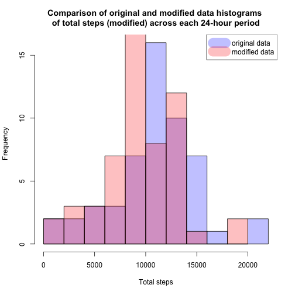
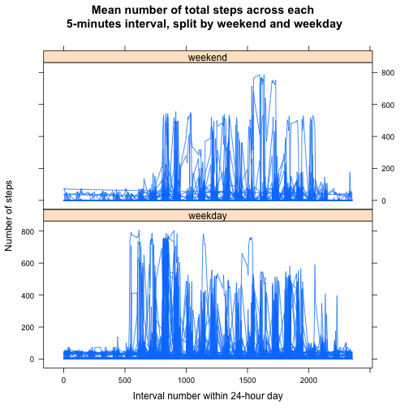

## Loading and preprocessing the data
1. Load the data (i.e. read.csv())


```r
setwd("~/datasciencecoursera/Reproducible_Research/Project1/RepData_PeerAssessment1")
if (!file.exists("activity.csv")) {
    unzip("activity.zip")
}
data <- read.csv("activity.csv", header = TRUE, stringsAsFactors = FALSE)
str(data)
```

```
## 'data.frame':	17568 obs. of  3 variables:
##  $ steps   : int  NA NA NA NA NA NA NA NA NA NA ...
##  $ date    : chr  "2012-10-01" "2012-10-01" "2012-10-01" "2012-10-01" ...
##  $ interval: int  0 5 10 15 20 25 30 35 40 45 ...
```


2. Process/transform the data (if necessary) into a format suitable for your analysis

In this section, I have created two more columns of data:<br>
- date_posix: the date of each data point in POSIXct format<br>
- date_time_posix: the date and time of each data point in POSIXct format<br>


```r
data <- cbind(data, date_posix = strptime(data$date, "%Y-%m-%d"))  
temp <- paste(data$date, round(data$interval/100), data$interval %% 100)
data <- cbind(data, date_time_posix = strptime(temp, "%Y-%m-%d %H %M"))
str(data)
```

```
## 'data.frame':	17568 obs. of  5 variables:
##  $ steps          : int  NA NA NA NA NA NA NA NA NA NA ...
##  $ date           : chr  "2012-10-01" "2012-10-01" "2012-10-01" "2012-10-01" ...
##  $ interval       : int  0 5 10 15 20 25 30 35 40 45 ...
##  $ date_posix     : POSIXct, format: "2012-10-01" "2012-10-01" ...
##  $ date_time_posix: POSIXct, format: "2012-10-01 00:00:00" "2012-10-01 00:05:00" ...
```


## What is mean total number of steps taken per day?

For this part of the assignment, we ignore the missing values in the dataset.

1. Make a histogram of the total number of steps taken each day

For this section, I summed the number of steps taken within each 24-hour period
within each day.


```r
steps_per_day <- ddply(data, .(date_posix), summarize, sum = sum(steps))
hist1 <- hist(steps_per_day$sum, 
        breaks = 10,
        main = "Histogram of total steps taken within each 24-hour period",
        xlab = "Total steps")
```

 

As shown in the graph above, the 24-hour periods that contained between 10,000 and 12,000 total steps were most frequently observed. For example, Days 3 and 4 (2012-10-03 and 2012-10-04) contained 11352 and 12116  total steps each, respectively. The results from these two days contributed to the greatest frequency distribution.

2. Calculate and report the <b>mean</b> and <b>median</b> total number of steps taken per day


```r
steps_metrics <- ddply(data, .(date_posix), summarize, mean = mean(steps), median = median(steps))
```

```
## Warning: closing unused connection 5 (repdata_data_StormData.csv.bz2)
## Warning: closing unused connection 4 (repdata_data_StormData.csv.bz2)
```

```r
min_steps <- min(steps_metrics$mean, na.rm = TRUE)
max_steps <- max(steps_metrics$mean, na.rm = TRUE)

plot(steps_metrics$date_posix, steps_metrics$mean, 
     main = "Mean number of total steps across each 24-hour period",
     xlab = "Day within two month period (2012-10-01 to 2012-11-30)",
     ylab = "Average value")
```

 

As shown in the graph above, the mean number of steps taken per day varies between 0.1424 and 73.5903. For example, the mean number of steps taken during Day 2 (2012-10-02) across all 5-minutes intervals was 0.4375. (Values of NA are not plotted.)


```r
plot(steps_metrics$date_posix, steps_metrics$median, 
     main = "Median number of total steps across each 24-hour period",
     xlab = "Day within two month period (2012-10-01 to 2012-11-30)",
     ylab = "Median value")
```

 

As shown in the graph above, the median number of steps taken per day varies 
is zero for all intervals. (Values of NA are not plotted.)


## What is the average daily activity pattern?

1. Make a time series plot (i.e. `type = "l"`) of the 5-minute interval (x-axis) and the average number of steps taken, averaged across all days (y-axis).


```r
interval_mean <- ddply(data, .(interval), summarize, mean = mean(steps, na.rm = TRUE), median = median(steps, na.rm = TRUE))
plot(interval_mean$mean, 
     type = "l",
     main = "Mean number of total steps across each 5-minutes interval",
     xlab = "Interval number within 24-hour day",
     ylab = "Mean value")
```

 

There are 288 5-minute intervals within a 24-hour day. As shown in the graph above, this is the mean number of total steps of all 61 days across each of these 288 5-min intervals.

2. Which 5-minute interval, on average across all the days in the dataset, contains the maximum number of steps?


```r
max <- interval_mean$interval[which.max(interval_mean$mean)]
temp2 <- paste(round(max/100), max %% 100)
time <- strptime(temp2, "%H %M")
x2 <- sub(".* ", "", time)
max_steps <- max(interval_mean$mean)
```

The 5-minute time interval labeled "835" contains the maximum number of steps 
(206.1698). This represents the 5-minute interval starting at 08:35:00 each
day. 

## Imputing missing values

Note that there are a number of days/intervals where there are missing values (coded as NA). The presence of missing days may introduce bias into some calculations or summaries of the data.

1. Calculate and report the total number of missing values in the dataset (i.e. the total number of rows with NAs)


```r
missing <- sum(is.na(data$steps)) 
```

There are a total of 2304 NAs in the original dataset.

2. Devise a strategy for filling in all of the missing values in the dataset. The strategy does not need to be sophisticated. For example, you could use the mean/median for that day, or the mean for that 5-minute interval, etc.

For this task, I replaced each NA value with the rounded mean for the corresponding 5-minute interval. If the rounded mean for the 5-min interval was NA, then I replaced it with '0' instead.

3. Create a new dataset that is equal to the original dataset but with the missing data filled in.

The dataset called "data_mod" is equal to the original dataset, but has all occurances of "steps=NA" replaced with data as described in the previous section.


```r
data_mod <- data
j <- length(data_mod$steps)
z <- length(steps_metrics$mean)
for (i in 0:(j-1)) { 
    if (is.na(data_mod$steps[i+1])) data_mod$steps[i+1] <- round(steps_metrics$mean[(i%%z)+1])
    if (is.na(steps_metrics$mean[(i%%z)+1])) data_mod$steps[i+1] <- 0
}
```

4. Make a histogram of the total number of steps taken each day and calculate and report the mean and median total number of steps taken per day. Do these values differ from the estimates from the first part of the assignment? What is the impact of imputing missing data on the estimates of the total daily number of steps?


```r
mod_steps_per_day <- ddply(data_mod, .(date_posix), summarize, sum = sum(steps))
hist2 <- hist(mod_steps_per_day$sum,
        main = "Histogram of total steps taken within each \n24-hour period (modified data)",
        xlab = "Total steps")
```

 


```r
plot(hist1, col=rgb(0,0,1,1/4), 
     main = "Comparison of original and modified data histograms \nof total steps (modified) across each 24-hour period",
     xlab = "Total steps")
plot(hist2, col=rgb(1,0,0,1/4), add=T)
legend("topright", 
        c("original data", "modified data"),
       lty=c(1,1),
       lwd=c(23,23),col=c(rgb(0,0,1,1/4),rgb(1,0,0,1/4)))
```

 

As shown above, when the histograms from the original and modified data are overlayed,
it is easier to see the impact of imputing missing data.


```r
mod_steps_metrics <- ddply(data_mod, .(date_posix), summarize, mean = mean(steps), median = median(steps)) 
plot(mod_steps_metrics$date_posix, mod_steps_metrics$mean,
     main = "Average number of total steps (modified data) \nacross each 24-hour period",
     xlab = "Day within two month period (2012-10-01 to 2012-11-30)",
     ylab = "Average value")
```

 

As shown above, this is the average number of total steps in the modified data
is slightly greater across each 24-hour period than the original data.


```r
plot(mod_steps_metrics$date_posix, mod_steps_metrics$median,
     main = "Median total steps (modified) across each 24-hour period",
     xlab = "Day within two month period (2012-10-01 to 2012-11-30)",
     ylab = "Median value")
```

 

As shown above, this is the median number of total steps (modified data) across each 24-hour period.

## Are there differences in activity patterns between weekdays and weekends?

For this part the weekdays() function may be of some help here. Use the dataset with the filled-in missing values for this part.

1. Create a new factor variable in the dataset with two levels – “weekday” and “weekend” indicating whether a given date is a weekday or weekend day.


```r
day_of_week_mod <- factor(ifelse(as.integer(strftime(data_mod$date_posix,'%u'))>5, "weekend", "weekday"))
data_mod <- cbind(data_mod, day_of_week_mod)
str(data_mod)
```

```
## 'data.frame':	17568 obs. of  6 variables:
##  $ steps          : num  0 0 39 42 46 54 38 0 44 34 ...
##  $ date           : chr  "2012-10-01" "2012-10-01" "2012-10-01" "2012-10-01" ...
##  $ interval       : int  0 5 10 15 20 25 30 35 40 45 ...
##  $ date_posix     : POSIXct, format: "2012-10-01" "2012-10-01" ...
##  $ date_time_posix: POSIXct, format: "2012-10-01 00:00:00" "2012-10-01 00:05:00" ...
##  $ day_of_week_mod: Factor w/ 2 levels "weekday","weekend": 1 1 1 1 1 1 1 1 1 1 ...
```

I added a new column called "day_of_week_mod" that includes this new data.

2. Make a panel plot containing a time series plot (i.e. `type = "l"`) of the 5-minute interval (x-axis) and the average number of steps taken, averaged across all weekday days or weekend days (y-axis). See the README file in the GitHub repository to see an example of what this plot should look like using simulated data.


```r
library(lattice)
xyplot(steps ~ interval | day_of_week_mod, 
        data = data_mod, 
        layout = c(1, 2), 
        type = "l", 
        main = "Mean number of total steps across each \n5-minutes interval, split by weekend and weekday",
        xlab = "Interval number within 24-hour day",
        ylab = "Number of steps")
```

 

As shown above, there are differences in activity patterns between weekdays and weekends.
